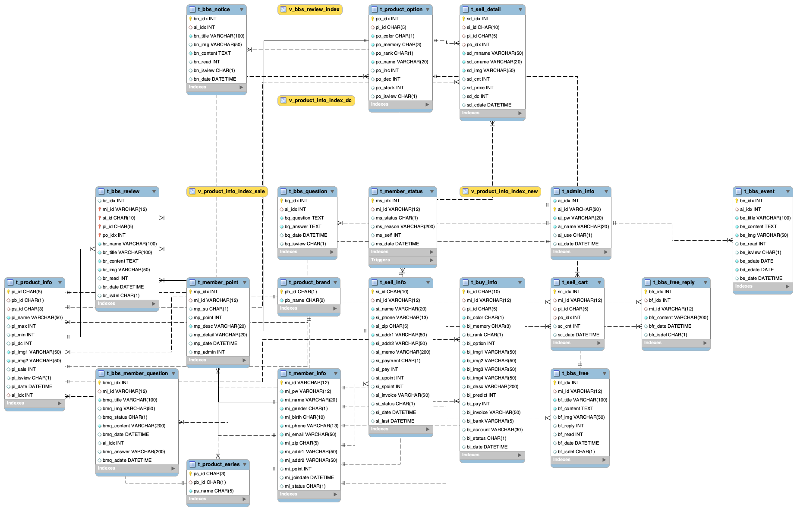
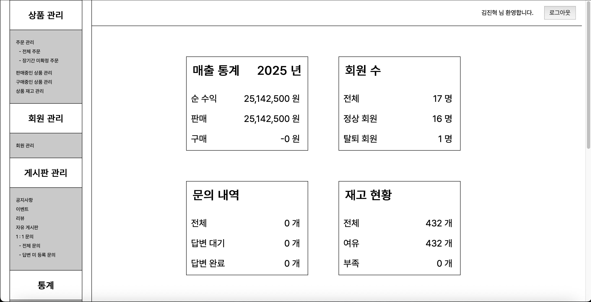
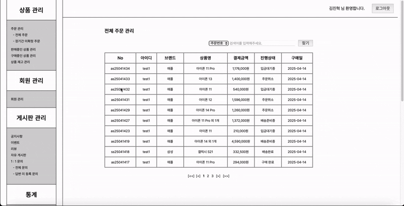
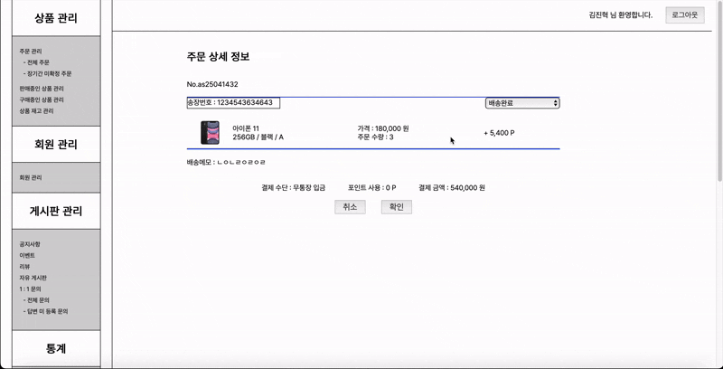
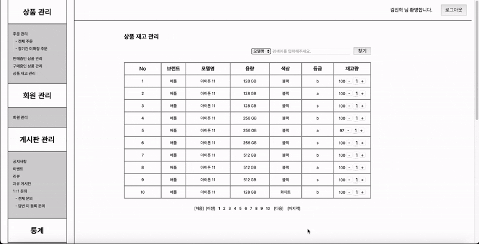
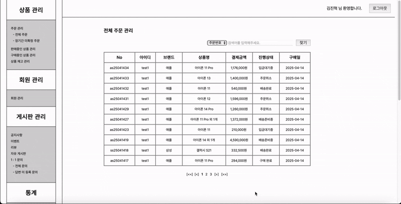

# 🧑‍💼 JSP 쇼핑몰 관리자(Admin) 기능 구현 프로젝트

## 📌 프로젝트 개요
Java 기반 JSP/Servlet 환경에서 **쇼핑몰 관리자(Admin) 전용 백오피스 기능**을 설계하고 구현한 프로젝트입니다.  
회원이 등록한 구매 요청, 판매 내역, 주문 상태 관리, 송장 등록 등 **운영자 입장에서의 핵심 관리 기능**을 중심으로 개발하였습니다.

---

## 🛠️ 사용 기술

| 구분        | 기술 스택 |
|-------------|-----------|
| Language    | Java 1.8 |
| Web         | JSP, Servlet, JSTL, EL |
| DB          | MySQL, JDBC (수동 트랜잭션 관리) |
| Architecture | MVC (DAO, Service, Controller) |
| 기타        | HTML, CSS, JavaScript |

---

## 🧩 주요 기능 (Admin Side)

### ✅ 구매 상품 승인 관리
- 구매 요청 상태(`bi_status`)에 따라 다음 상태로 전이:  
  `d: 검수완료 → h: 결제완료 → k: 구매확정`
- 상태에 따라 옵션 ID 및 가격 자동 계산 처리
- 구매 확정 시 포인트 제공 및 취소시 재고 복구 처리 포함

### ✅ 판매 주문 처리
- 주문 상세 내역 확인 기능
- 송장 번호 입력 시 자동으로 '배송중' 상태 변경
- 관리자에 의한 주문 상태 수동 변경 기능 (결제완료 → 배송중/완료 등)

### ✅ 관리자용 통합 검색 및 페이징
- 회원 ID, 주문번호, 모델명 기준 검색 기능
- 페이징 처리된 목록 출력
- 주문 상세 항목 다건 구매 시 `"모델명 외 N개"` 표시 처리

---

## 📊 데이터베이스 설계 (ERD)



쇼핑몰 전체 기능을 고려한 20개 이상의 테이블을 설계하고,  
회원/상품/주문/리뷰/장바구니/포인트 등 기능별로 정규화된 구조로 구축하였습니다.

### 📌 주요 테이블 요약

- **t_member_info**: 회원 기본 정보
- **t_product_info / t_product_option**: 상품 정보 및 색상/용량/등급 옵션, 재고 포함
- **t_sell_info / t_sell_detail**: 주문 기본 정보 및 주문 상세 항목
- **t_sell_cart**: 장바구니 테이블
- **t_member_point**: 포인트 적립/사용 내역 관리
- **t_buy_info**: 사용자의 중고폰 판매 요청 내역
- **t_admin_info**: 관리자 로그인 정보
- **t_bbs_***: 게시판 관련 테이블 (공지, 리뷰, 질문, 이벤트 등)

> 데이터 정합성과 비즈니스 흐름을 고려하여, 외래키 대신 어플리케이션 단 로직 처리 중심으로 설계함.

---

## 📷 시연 화면
- 어드민 메인페이지(대략적으로 정보 조회 가능)
- 

- 주문
- 

- 포인트 적립 확인
- 

- 주문 취소
- 

- 재고 수량 관리
- 

- 조건에 맞는 검색기능
- 
---

## 🧑‍💻 담당 역할
- 구매/판매 데이터 흐름 기반 어드민 기능 전체 설계 및 구현
- 상태 코드 기반 업무 흐름 처리 로직 구축 (`검수 → 결제완료 → 확정`)
- 옵션 자동 매핑 및 예상가/결제가 계산 로직 개발
- 트랜잭션 처리 기반 데이터 정합성 확보
- 관리자 검색/조회/송장처리 기능까지 End-to-End 구현

---

## 📂 프로젝트 실행 방법
```bash
# MySQL DB 연동 및 초기 테이블 설정
# Tomcat 8.5 이상, JDK 1.8 이상에서 실행
